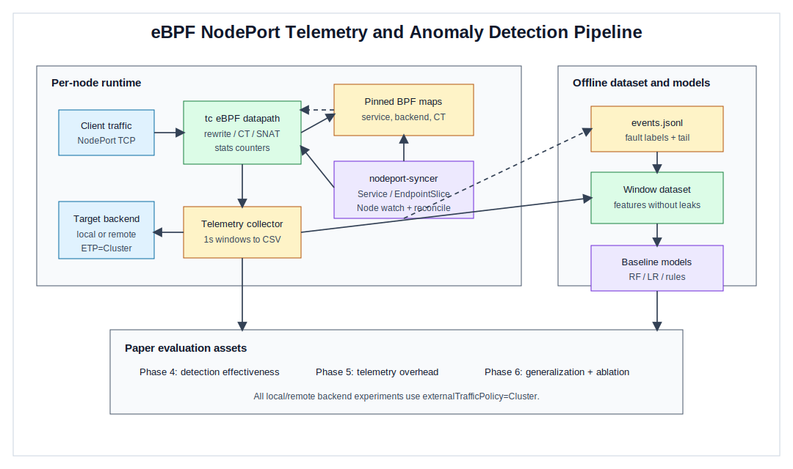

# 基于 eBPF 遥测的 Kubernetes NodePort 服务异常检测

## 摘要

Kubernetes Service 为集群应用提供了统一的访问抽象，其中 NodePort 是基础的南北向入口机制之一。随着微服务规模扩大，NodePort 路径上的异常不再只表现为简单的服务不可达，而可能体现为后端频繁变化、连接跟踪压力上升、跨节点路径退化、控制面恢复延迟等多种时序模式。传统监控手段通常依赖用户态指标、日志或探针结果，难以及时捕获数据面内部状态变化；而完整替换 Kubernetes Service 数据面又会引入较高的部署门槛。本文提出一种基于 eBPF 遥测的 Kubernetes NodePort 服务异常检测方法。该方法在每个节点部署 agent，通过 tc eBPF 程序采集 NodePort 数据面统计、连接跟踪状态、转发结果与错误计数，并结合 Kubernetes Service、EndpointSlice 和 Node 事件构造窗口化特征。本文进一步设计了可复现的故障注入工具链，构建了覆盖正常稳态、后端变更、控制面恢复、连接跟踪压力、路径退化、Service 重建和负载突增等场景的数据集，并评估规则方法、逻辑回归和随机森林等轻量模式识别模型。

在主数据集 `phase3_v1` 上，最佳二分类随机森林模型在测试集上取得 `0.7774` 的 anomaly F1 和 `0.8449` 的 PR-AUC；最佳多分类模型取得 `0.4181` 的 macro-F1。系统开销实验表明，在 `externalTrafficPolicy=Cluster` 前提下，telemetry 打开后 remote backend 场景吞吐从 `814.82 rps` 变为 `764.18 rps`，约下降 `6.21%`，p50 和 p99 延迟未观察到恶化。进一步的泛化实验表明，固定 Phase 4 模型在新负载和新拓扑下存在明显误报和多分类退化，说明跨场景模型适配仍是后续工作的关键问题。特征消融结果显示，去掉数据面统计特征后，二分类测试 anomaly F1 从 `0.7774` 降至 `0.4982`，多分类测试 macro-F1 从 `0.4181` 降至 `0.2339`，证明 eBPF 数据面遥测是当前检测效果的主要来源。本文的结论是：eBPF 遥测能够为 Kubernetes NodePort 异常检测提供有价值的可在线采集特征，但跨负载、跨拓扑泛化和 agent CPU 成本仍需要进一步优化。

关键词：eBPF；Kubernetes；NodePort；异常检测；模式识别；服务遥测

## 1. 引言

Kubernetes 已经成为云原生应用部署和运维的事实标准。Service 抽象隐藏了 Pod 动态变化带来的地址不稳定性，使应用可以通过稳定的虚拟入口访问后端实例。在多种 Service 暴露方式中，NodePort 通过在每个节点上开放固定端口，为外部流量进入集群提供了直接路径。虽然 NodePort 的语义相对简单，但其实际转发路径横跨节点网络、Kubernetes 控制面、后端 Pod 生命周期、连接跟踪状态和底层 CNI 行为。任何一个环节发生变化，都可能以不同形式影响请求转发质量。

已有监控方案通常关注服务级指标，例如请求成功率、响应延迟、Pod 状态和节点资源使用率。这些指标有助于确认问题已经发生，却难以解释数据面内部到底出现了何种变化。例如，当 EndpointSlice 快速变化时，转发后端可能短时间内频繁切换；当短连接压力升高时，连接跟踪表规模和命中行为会发生变化；当跨节点路径退化时，请求仍可能成功，但数据面转发特征与正常路径不同。这些变化往往在内核数据面中最先出现。

eBPF 为细粒度、低开销的数据面观测提供了新的可能。与依赖日志或用户态代理的方案相比，eBPF 可以在包处理路径上直接采集转发命中、后端选择、连接跟踪、重写失败和 redirect 结果等信号。与此同时，Kubernetes 控制面事件提供了 Service、EndpointSlice 和 Node 状态变化的上下文。将这两类信号组合起来，可以把 NodePort 异常检测建模为一个时序窗口上的模式识别问题。

本文基于 `ebpf_nodeport` 原型系统，构建了一套面向 Kubernetes NodePort 的异常检测框架。与“替代 kube-proxy 的完整 Service 数据面系统”不同，本文的重点不是证明一个 eBPF NodePort 实现功能更全，而是研究 eBPF 数据面遥测能否为 NodePort 异常模式识别提供有效特征。本文贡献如下：

1. 提出一种基于 eBPF 数据面统计、连接跟踪状态和 Kubernetes 控制面事件的 NodePort 遥测采集框架。
2. 构建一套可脚本化复现的 NodePort 故障注入与数据集构建流程，覆盖多类服务异常和负载变化。
3. 系统评估轻量模型在窗口级异常检测、多分类、运行时开销、泛化和特征消融上的表现，明确给出当前方法的有效性与边界。

本文其余部分组织如下。第 2 节介绍背景与动机。第 3 节讨论相关工作。第 4 节描述系统设计。第 5 节说明数据集构建方法。第 6 节给出实验设置。第 7 节分析主要实验结果。第 8 节讨论发现与工程意义。第 9 节总结局限性与未来工作。第 10 节给出结论。

## 2. 背景与动机

### 2.1 Kubernetes NodePort 转发路径

NodePort Service 在每个节点上暴露固定端口。外部客户端访问任一节点的 NodePort 后，集群网络栈会将请求转发到某个后端 Pod。后端可能位于入口节点本机，也可能位于其他节点。本文中 `local backend` 和 `remote backend` 均指 `externalTrafficPolicy=Cluster` 前提下的后端拓扑：前者表示入口节点与唯一后端位于同一节点，后者表示入口节点与唯一后端位于不同节点。本文不研究 `externalTrafficPolicy=Local` 语义。

在 `externalTrafficPolicy=Cluster` 下，入口节点可以把流量转发到集群内任意可用后端。这个机制提升了可用性，但也使数据面状态更复杂。后端数量变化、后端节点位置变化、跨节点隧道或路由变化，都会改变请求路径。单纯观察 Service 是否存在或 Pod 是否 Running，不能完整刻画真实转发行为。

### 2.2 为什么需要 eBPF 遥测

NodePort 异常检测需要捕获两类信号。第一类是控制面信号，例如 Service 更新、EndpointSlice 变化和 Node 状态变化。第二类是数据面信号，例如请求是否命中 NodePort、是否完成后端选择、连接跟踪是否命中、是否发生重写失败或 redirect 失败。前者解释“配置和对象发生了什么”，后者解释“包在实际转发路径上发生了什么”。

eBPF 适合作为第二类信号来源。它可以在 tc hook 上观察包处理过程，并把关键计数写入 BPF map。用户态 agent 再以固定窗口读取这些 map，形成可训练的时间序列样本。相比只依赖高层探针，这种方式可以更早捕获数据面压力和路径变化。

### 2.3 从系统问题到模式识别问题

如果只讨论 eBPF NodePort 加速，本文容易落入纯系统实现的比较：功能是否覆盖 kube-proxy、性能是否超过现有方案、是否支持更多协议。本文采用不同定位：把 `ebpf_nodeport` 作为遥测平台，研究其产生的多维信号是否能够支持异常模式识别。

这种定位更适合 AIPR 风格的论文。本文关注的不是“一个更完整的 Kubernetes 网络组件”，而是“如何从系统数据面中提取可用于模式识别的特征，并评估其检测能力与泛化边界”。

## 3. 相关工作

### 3.1 Kubernetes Service 数据面

Kubernetes Service 的默认实现通常依赖 kube-proxy，通过 iptables 或 IPVS 在节点上维护服务转发规则。此类机制成熟稳定，适合生产环境，但其观测接口主要暴露在规则、连接状态和高层指标层面，难以直接形成面向异常检测的细粒度窗口特征。近年来，Cilium 等系统使用 eBPF 实现 Kubernetes Service load balancing，在性能、可观测性和策略扩展方面展示了 eBPF 数据面的潜力。本文与这些工作的区别在于：本文不试图提供一个完整替代 kube-proxy 或 Cilium 的数据面，而是利用一个受控的 NodePort 原型系统研究 eBPF 数据面信号对异常模式识别的价值。

### 3.2 云原生监控与故障诊断

Prometheus、日志系统和分布式追踪等工具是云原生监控的常见基础设施。它们能够提供请求成功率、延迟、Pod 状态、节点资源和应用日志等指标，对运维诊断非常重要。然而，这些信号通常位于用户态或服务层，难以直接反映内核转发路径中的后端选择、连接跟踪、重写失败和 redirect 行为。本文将这些数据面内部信号补充到窗口化样本中，并与 Kubernetes 控制面事件一起建模，使检测任务不仅依赖服务是否可达，也能利用转发路径内部状态变化。

### 3.3 异常检测与模式识别

时间序列异常检测和 AIOps 研究通常关注指标序列中的突变、周期偏离和跨指标关联。深度模型可以表达复杂时序模式，但也需要更大规模、更稳定的数据集。本文当前数据集来自可控故障注入，规模仍属于原型验证阶段，因此优先选择规则基线、逻辑回归和随机森林等轻量模型。这样的选择便于解释特征贡献，也便于通过消融实验回答“哪些系统遥测信号真正有用”。后续工作可以在更大规模数据集上引入时序模型、域自适应和在线校准。

## 4. 系统设计

### 4.1 总体架构

系统由三部分组成：eBPF 数据面、节点级控制面和遥测导出器。eBPF 数据面挂载在 tc hook 上，处理 IPv4/TCP NodePort 流量，并在转发过程中维护统计计数和连接跟踪状态。节点级控制面 `nodeport-syncer` 监听 Kubernetes Service、EndpointSlice 和 Node 对象，将目标 Service 的前端、后端和配置状态同步到 pinned BPF maps。遥测导出器周期性读取 BPF maps、控制面事件和后端视图，输出窗口化 CSV 样本。

本文系统采用每节点自治的部署方式。每个节点上的 agent 负责探测本节点网络角色、启动 syncer、管理 tc attach，并为实验输出本节点的 telemetry 文件。该方式不要求集中式控制器参与每个窗口的采样，适合小规模和异构集群实验。

### 4.2 eBPF 数据面信号

数据面采集的特征包括 TCP 包计数、NodePort 命中、后端选择、轮询状态更新、SNAT 安装、请求重写、响应侧 rev-NAT、连接跟踪 miss、响应重写、forward CT 命中、新连接、map miss、rewrite fail、redirect ok/fail 和 fallback pass 等。这些计数以累计方式存储，遥测导出器在每个窗口计算增量。

这些信号对异常检测有直接意义。例如，连接跟踪压力会改变 `new_conn`、`ct_lookup_miss` 和 CT 表规模；后端变化会影响 backend 数量和选择行为；路径退化可能导致 redirect 或重写相关计数发生变化；控制面恢复期间可能出现短时间 map miss 或 fallback 行为。

### 4.3 连接跟踪与 GC 信号

系统维护请求方向和响应方向的连接状态，并为 CT 与 forward CT 增加老化和 GC 逻辑。遥测样本中记录当前 CT 表规模、forward CT 表规模、GC 运行次数、GC 删除条目数、CT 超时和 GC 间隔。连接生命周期信号使模型能够区分普通流量波动和连接状态压力。

### 4.4 Kubernetes 控制面事件

遥测导出器将 Service、EndpointSlice 和 Node 事件映射到窗口样本中。第一版不让 exporter 自行推断异常，而是由故障注入脚本生成 `events.jsonl`，明确给出异常窗口的开始、结束、标签和恢复尾窗。这样可以降低标注歧义，使训练数据的标签来源可复现。

### 4.5 范围边界

当前系统范围限定为 IPv4/TCP、NodePort、`externalTrafficPolicy=Cluster`。本文所有 `local backend` 与 `remote backend` 实验均在 `ETP=Cluster` 前提下进行，仅改变后端位于入口节点本地还是远端节点。系统当前不覆盖 UDP、IPv6、DSR、sessionAffinity、`externalTrafficPolicy=Local` 和多 CNI 泛化。

## 5. 数据集构建

### 5.1 窗口化样本

遥测导出器以固定时间窗口输出样本。每条样本对应一个节点、一个目标 Service 和一个时间窗口。样本字段包括窗口时间、节点信息、数据面增量计数、CT/GC 状态、Kubernetes 事件位、后端数量、local/remote backend 构成和标签。主训练数据集 `phase3_v1` 使用单目标 Service，以避免节点级 BPF stats map 在多 Service 场景下引入归因歧义。

### 5.2 故障注入场景

本文通过脚本化实验构建异常数据。主要场景包括：

- `normal_steady_state`：稳定访问 NodePort，无异常注入。
- `backend_churn`：通过 rollout 或 EndpointSlice 变化制造后端波动。
- `control_plane_recovery`：通过 agent 重启或 map rebuild 模拟控制面恢复。
- `conntrack_pressure`：通过并发短连接制造连接跟踪压力。
- `path_degradation`：通过 netem 在跨节点路径上注入延迟和丢包。
- `service_reconcile`：删除并重建 Service，触发 Service 状态重同步。
- `load_surge`：只注入高强度流量脉冲，不改变控制面对象。

每个异常脚本负责生成 artifact 目录、`events.jsonl`、低频探活日志、每节点 CSV 和实验说明。只有通过脚本验收的实验才进入数据集选择清单。

### 5.3 主数据集 `phase3_v1`

主数据集包含 `20` 个实验、`1450` 行窗口样本和 `57` 个字段，划分为 `train=541`、`val=400`、`test=509`。标签分布为：`normal=1057`、`backend_churn=19`、`conntrack_pressure=107`、`control_plane_recovery=22`、`load_surge=108`、`path_degradation=107`、`service_reconcile=30`。质量报告显示错误数和警告数均为 `0`。

### 5.4 泛化数据集 `phase6_generalization_v1`

泛化数据集不参与 Phase 4 训练，只用于评估固定模型在新负载和新拓扑下的迁移表现。该数据集包含 `16` 个实验和 `1896` 行窗口样本，其中正常稳态实验 `6` 轮，异常实验 `10` 轮。标签分布为：`normal=1657`、`backend_churn=24`、`conntrack_pressure=143`、`path_degradation=72`。

## 6. 实验设置

### 6.1 集群与拓扑

实验在两工作节点拓扑上进行，入口节点固定为 `worker1`。`local backend` 表示唯一后端固定在 `worker1`，`remote backend` 表示唯一后端固定在 `worker2`，两者均属于 `ETP=Cluster` 下的后端位置差异。`worker3` 与 master 节点不纳入正式 Phase 1-6 评估。

### 6.2 模型与任务

本文评估两个任务。二分类任务将 `normal` 作为负类，所有异常标签作为正类。多分类任务仅在异常窗口上训练和评估，类别包括 `backend_churn`、`conntrack_pressure`、`control_plane_recovery`、`load_surge`、`path_degradation` 和 `service_reconcile`。

基线模型包括 DummyClassifier、规则检测器、Logistic Regression 和 Random Forest。最终二分类最佳模型为 `rf_n100_dnone_leaf5_cwnone`，多分类最佳模型为 `rf_n100_dnone_leaf5_cwbalanced`。所有结果均基于固定随机种子和固定数据划分。

### 6.3 特征选择与防泄漏

为避免实验标签或离线元数据泄漏到模型中，训练特征显式排除三类字段。第一类是直接标签与标注状态，包括 `label`、`label_source`、`anomaly_active` 和 `recovery_active`。第二类是实验划分、对象标识和时间定位字段，包括 `split`、`experiment_id`、`experiment_type`、`node_name`、`node_ip`、`service_namespace`、`service_name`、`service_nodeport`、`source_artifact_dir`、`window_start_unix_ms` 和 `window_end_unix_ms`。第三类是结果背景字段，包括 `traffic_probe_total`、`traffic_probe_success` 和 `traffic_probe_success_rate`。这些字段可用于实验记录和质量检查，但不进入训练特征。

剩余候选字段经过数值化和缺失值填充后，再删除训练集常量列。最终 Phase 4 baseline 使用 `27` 个特征，主要来自数据面增量计数、CT/GC 状态、后端拓扑和 Kubernetes 事件位。多分类任务只在异常窗口上训练和评估，避免将 `normal` 类作为多分类输出的一部分。

### 6.4 评估指标

二分类关注 anomaly precision、recall、F1、PR-AUC、ROC-AUC 和 balanced accuracy。多分类关注 macro-F1、balanced accuracy 和每类 precision/recall/F1。系统开销关注 throughput、p50/p99 latency、节点 CPU 和 agent CPU。泛化评估关注正常稳态误报率、异常二分类 F1 和多分类 macro-F1。消融评估关注去除特征组后的性能下降。

## 7. 实验结果

### 7.1 主数据集检测效果

在原型规模主数据集 `phase3_v1` 上，最佳二分类随机森林模型在验证集上取得 `0.7349` 的 anomaly F1 和 `0.8277` 的 PR-AUC，在测试集上取得 `0.7774` 的 anomaly F1 和 `0.8449` 的 PR-AUC。这说明在当前实验级划分下，eBPF 数据面遥测与控制面事件的组合能够区分正常窗口和异常窗口。

多分类任务更困难。最佳多分类模型在验证集上取得 `0.3722` 的 macro-F1 和 `0.3744` 的 balanced accuracy，在测试集上取得 `0.4181` 的 macro-F1 和 `0.4159` 的 balanced accuracy。按类看，`conntrack_pressure`、`control_plane_recovery` 和 `path_degradation` 的效果较好，而 `backend_churn` 表现最弱，测试集 F1 为 `0.0000`。这说明异常类型之间的可分性差异明显，尤其是后端变化窗口较短、样本较少，容易与其他控制面扰动混淆。

### 7.2 运行时开销

Phase 5 评估了 telemetry off/on 与 local/remote backend 的 `2x2` 矩阵。所有 local/remote 表述均指 `ETP=Cluster` 下的后端拓扑。

在 remote backend 场景下，telemetry 关闭时吞吐为 `814.82 rps`，开启后为 `764.18 rps`，下降约 `6.21%`。p50 延迟从 `7.034 ms` 变为 `6.492 ms`，p99 从 `26.211 ms` 变为 `23.756 ms`，未观察到尾延迟恶化。worker1 agent CPU 增加约 `14.47` 个百分点，worker2 agent CPU 基本不变。由于 agent CPU 按单核百分比统计，数值超过 `100` 表示该进程组在测量窗口内消耗了超过一个 CPU core 的时间份额；因此本文将开销结论限定为“吞吐与尾延迟未显著恶化”，而不把当前实现描述为已经充分优化。

在 local backend 场景下，telemetry 关闭时吞吐为 `694.83 rps`，开启后为 `870.98 rps`。该结果不应被解释为 telemetry 提升了性能，而更可能反映拓扑切换、短时间收敛和测量波动的影响。Phase 5 Round 02 已确认 local-only backend 路径在 `ETP=Cluster` 下可以工作，但该场景对正式压测前的 readiness gating 更敏感。因此，本文在开销结论中以 remote backend 场景作为更稳健的 overhead 证据，同时保留 local backend 作为补充说明。

### 7.3 泛化评估

Phase 6 使用固定 Phase 4 最优模型，在新负载和新拓扑数据集 `phase6_generalization_v1` 上做推理。结果显示，模型在新场景上的泛化能力有限。

在正常稳态上，local backend 的误报率约为 `0.3731` 至 `0.3780`，remote backend 的误报率约为 `0.4719` 至 `0.7008`。这说明 Phase 4 训练得到的二分类边界对新负载条件较敏感，尤其是在 remote backend 的正常流量上容易误判为异常。

在异常二分类上，总体 anomaly F1 为 `0.3570`，PR-AUC 为 `0.2938`，ROC-AUC 为 `0.5812`。分场景看，`conntrack_pressure` 最容易迁移，remote medium 与 remote high 的 anomaly F1 分别为 `0.6526` 和 `0.6261`；`backend_churn` 最弱，F1 约为 `0.0833` 至 `0.1311`；`path_degradation` 对负载档位敏感，remote high 为 `0.5373`，remote medium 仅为 `0.1833`。

多分类泛化退化更明显，总体 macro-F1 为 `0.0697`，balanced accuracy 为 `0.1020`。需要说明的是，Phase 6 泛化数据集只覆盖 `backend_churn`、`conntrack_pressure` 和 `path_degradation` 三类异常，但评估仍固定使用 Phase 4 的六类异常输出空间，因此该结果反映的是固定六分类模型在新负载、新拓扑和部分类别缺失条件下的整体迁移表现。这说明固定 Phase 4 多分类模型难以直接迁移到 Phase 6 的新负载与新拓扑组合。本文将该结果视为重要边界：当前特征具有检测价值，但模型仍需要跨场景训练、校准或在线适配。

### 7.4 特征消融

特征消融使用 `phase3_v1`，复用 Phase 4 最佳随机森林配置。二分类中，`all_features` 的测试 anomaly F1 为 `0.7774`；去掉 `datapath_stats` 后降至 `0.4982`，下降 `0.2792`；去掉 `ct_gc` 后为 `0.7034`；去掉 `k8s_events` 后为 `0.7375`；去掉 `topology_backend` 后为 `0.6988`。

多分类中，`all_features` 的测试 macro-F1 为 `0.4181`；去掉 `datapath_stats` 后降至 `0.2339`，下降 `0.1842`；去掉 `ct_gc` 后为 `0.3949`；去掉 `k8s_events` 后为 `0.4082`；去掉 `topology_backend` 后为 `0.3748`。

消融结果非常清楚：数据面统计是最关键的特征组，CT/GC 和拓扑后端信息也有可见贡献，Kubernetes 事件特征在当前数据集中的边际贡献较小。这并不意味着控制面事件不重要，而是说明当前窗口级标签和模型更依赖数据面计数来区分异常模式。

## 8. 讨论

### 8.1 eBPF 遥测的价值

本文结果表明，eBPF 数据面遥测不仅能作为调试工具，也能为模式识别提供有效特征。相比只观察探活成功率或 Pod 状态，数据面计数能更直接地反映请求路径、连接跟踪状态和转发行为。二分类结果和消融实验共同说明，这些特征对异常检测有实际贡献。

### 8.2 泛化退化的意义

Phase 6 的泛化退化不是单纯的失败结果，而是揭示了一个真实问题：系统遥测特征具有场景依赖性。不同负载强度、后端拓扑和异常注入方式会改变特征分布。如果模型只在一组较窄的故障注入数据上训练，就可能在新正常稳态上出现误报，或在新异常组合上分类不稳。因此，后续工作需要考虑跨场景数据增强、阈值校准、域自适应或在线更新。

### 8.3 AIPR 视角下的定位

本文的贡献是 Kubernetes 系统遥测上的模式识别方法，而不是完整 Service 数据面产品。`ebpf_nodeport` 提供了实验底座和遥测来源，模式识别任务则定义在窗口化特征上。这样的定位更贴近 AIPR 对特征、数据集、模型评估和消融分析的关注。

## 9. 局限性与未来工作

当前工作有以下局限。

第一，系统范围有限。本文只覆盖 IPv4/TCP、NodePort 和 `externalTrafficPolicy=Cluster`。UDP、IPv6、DSR、sessionAffinity 和 `externalTrafficPolicy=Local` 均未纳入。

第二，网络环境有限。实验主要在 flannel encap 风格的两工作节点拓扑上完成，尚未验证第二种 CNI 或 direct-routing 环境。

第三，多分类样本仍偏少。部分异常类别样本数量有限，尤其是 `backend_churn` 和控制面类异常，这会影响多分类模型稳定性。

第四，泛化能力不足。Phase 6 显示固定模型在新负载和新拓扑上误报偏高，多分类退化明显。未来需要引入更系统的跨场景训练、模型校准和可能的时序模型。

第五，当前仍是离线推理评估。本文尚未实现在线检测闭环，也未评估告警延迟、告警聚合和生产环境误报处理。

未来工作可以从四个方向展开：扩展协议和 Service 语义覆盖；在不同 CNI 和网络模式下复现实验；增强数据集并引入更稳健的时序模型；将离线模型接入在线 agent，评估实时告警和持续学习机制。

## 10. 结论

本文提出并评估了一种基于 eBPF 遥测的 Kubernetes NodePort 服务异常检测方法。通过结合 eBPF 数据面计数、连接跟踪状态、Kubernetes 控制面事件和后端拓扑信息，本文构建了可复现的数据集和轻量模型评估流程。实验表明，在主数据集上，随机森林二分类模型可以取得较好的异常检测效果；运行时开销在 remote backend 场景下未造成明显吞吐和尾延迟恶化，但 agent CPU 成本仍有优化空间；特征消融证明数据面统计是最关键的信号来源。同时，泛化实验也揭示了固定模型在新负载和新拓扑上的明显边界。总体而言，eBPF telemetry 是 Kubernetes NodePort 异常检测的有力特征来源，但要走向更稳健的在线系统，还需要更丰富的数据覆盖和跨场景适配能力。

## 11. 候选参考文献

本节为中文初稿阶段的候选参考方向，英文投稿稿需要进一步整理为正式 BibTeX 条目。

1. Kubernetes 官方文档：Services、NodePort、EndpointSlice、externalTrafficPolicy。
2. Linux eBPF 官方文档与 tc hook 相关资料。
3. Cilium 关于 eBPF-based Kubernetes Service Load Balancing 的文档与论文。
4. kube-proxy iptables/ipvs 模式相关文档。
5. Brendan Gregg 关于 eBPF observability 的资料。
6. Prometheus 与云原生监控相关文献。
7. AIOps 异常检测综述。
8. Time-series anomaly detection 相关综述。
9. Random Forest 原始论文。
10. Logistic Regression 与基础模式识别教材。
11. Kubernetes 故障注入与 chaos engineering 相关文献。
12. SPIE/AIPR 作者指南与投稿格式说明。
